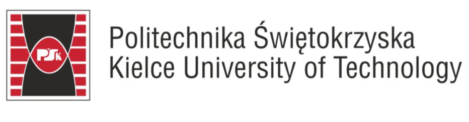

# Chat-bot implementation using NLP models in an embedded environment
 

## Introduction

Welcome to our project, "Chat-bot Implementation using NLP Models in an Embedded Environment", developed as a part of our coursework for the Defensive Programming course. This innovative project bridges the gap between advanced Natural Language Processing (NLP) models and the immersive world of Minecraft, creating an engaging and interactive gaming experience.
Our team has successfully integrated state-of-the-art NLP models from Hugging Face into the Minecraft environment, enabling dynamic and intelligent conversations between players and the game's NPCs (Non-Player Characters). This integration is powered by a robust Flask server, which acts as a conduit between the Hugging Face models and the Java-based Minecraft game.
This unique blend of technologies not only enhances the gameplay experience by allowing for more realistic and responsive interactions but also serves as a practical demonstration of the capabilities of embedded NLP models in a gaming context.
The project showcases the potential of modern NLP techniques in enhancing user experience in virtual environments, paving the way for more intuitive and human-like interactions in games.
Through this README, we aim to provide a comprehensive guide on how our project was conceived, developed, and can be implemented by others interested in exploring the intersection of NLP and gaming. We hope this project inspires further innovation in the field and serves as a valuable learning resource for students and developers alike.

## Prerequisites
Before you begin the installation process, ensure that you have Java 17 installed on your system. Java 17 is essential for running the Minecraft server and the chat-bot application. If you do not have Java 17 installed, you can download it from the official Java site.
## Setting Up the Project
To make the installation process as straightforward as possible, we have created a Gradle build task. This task simplifies the process, allowing you to set up and run the project with a single command. Here are the steps to get everything up and running.
### Clone the Repository
First, clone the project repository to your local machine using Git. You can do this by running the following command in your terminal.

`git clone git@github.com:bkomorniczak/glowing-octo-guide.git`
### Navigate to repository
Once the repository is cloned, navigate to the project directory:

`cd glowing-octo-guide`
### Running the program
To run the project, execute the following command in the project's root directory:

`./gradlew runAll`

This command will trigger the Gradle build task that we have set up. It takes care of compiling the code, setting up the necessary dependencies, and starting the Minecraft server.

## Interaction with NLPs
Integrating with mobs in our modification is now even simpler! Just hold down the Shift key and left-click on a mob, then chat with them freely using the Flask endpoint API.
### Mod commands
- **/nlpchat** - Display the main menu
- **/nlpchat ask "query"** - Ask a question to the AI
- **/nlpchat enable** - Enable the listening status for NLP chat
- **/nlpchat disable** - Disable the listening status for NLP chat
- **/nlpchat reset** - Resets the current settings to default
- **/nlpchat getToken** - Retrieves the current authentication token
- **/nlpchat setApiUrl "URL"** - Sets the NLP API endpoint URL
- **/nlpchat setToken "key" "value"** - Sets the NLP API authentication token
- **/nlpchat help** - Display this help message"""), false);
## Development environment description
In our development workflow, we leverage GitHub Actions as the foundation for our Continuous Integration (CI) process. The CI pipeline encompasses various tasks aimed at ensuring the reliability and quality of our codebase. The following key components are integral to our CI setup:
### Gradle build task
Our Gradle build task is a fundamental step in the CI process. Gradle is used to compile, assemble, and package our Java-based projects. This ensures that the code is correctly compiled and can be executed in the intended environment.
### Gradle test task
Testing is a crucial aspect of our development process, and the Gradle test task plays a pivotal role in this regard. We execute a comprehensive suite of tests to validate the functionality, performance, and reliability of our code. This task ensures that the application behaves as expected and that any changes introduced do not introduce regressions.
### Trivy
Security is a top priority in our development process. Trivy, a comprehensive vulnerability scanner for containers and applications, is integrated into our CI pipeline. It helps us identify and address potential security issues in dependencies, ensuring that our software is robust and resilient to security threats.

Those steps are described in [gradle.yml](.github/workflows/gradle.yml).
### Super-Linter
Maintaining a consistent and high-quality code style across our projects is vital. The Super-Linter is employed to analyze and enforce coding standards, ensuring uniformity in our codebase. This linter supports multiple languages, providing a comprehensive check for code quality and style adherence.
This step is described in [Linter.yml](.github/workflows/linter.yml) workflow.

These components collectively contribute to a robust CI environment that promotes code reliability, consistency, and security throughout the development lifecycle. As we continue to evolve our processes, these tools play a crucial role in maintaining the high standards we set for our projects.

## DEMO
Here is a little presentation of gameplay:

## Roadmap

### Development Perspectives and Potential Improvements

Our project, which combines Minecraft with Flask and NLP, offers numerous possibilities for development and enhancements.
Here are a few suggestions that we couldn't implement due to strict project deadlines.
#### Adding Voice Responses to Mobs
- **Integration of Speech Synthesis:** Implementing a text-to-speech (TTS) engine that converts NLP text responses into voice.
This would allow for more interactive and engaging in-game experiences, with mobs responding vocally to player queries.
- **Voice Personalization:** The ability to customize voices for different types of mobs, which would enhance immersion and diversify the gaming experience.
- **Contextual Reactions:** Developing the NLP system to allow mobs to react with different voice tones depending on the context of the interaction,
e.g., friendly tones during peaceful interactions and aggressive in conflict situations.
#### Supporting More Languages in NLP
- **NLP Expansion:** Adding support for multiple languages in the NLP model, enabling interactions in various languages.
This would increase the mod's accessibility and universality, allowing players from different regions to use it in their native language.
- **Automatic Language Detection:** Implementing a feature for automatic detection of the language of queries, which would streamline player interactions regardless of the language used.
#### Adapting to a Wider Range of APIs than Just Flask Endpoints
- **Support for Various Backends:** Expanding the API configuration to allow integration with various backends, not just Flask. This would provide flexibility in choosing backend technologies and make scaling the project easier.
- **Modular API:** Moving towards a more modular API architecture, which would allow for easy integration with new services and technologies, such as databases, cloud services, or other NLP platforms.
- **Flexibility and Configurability:** Enabling users to configure connection parameters with different services and APIs through an in-game user interface or configuration files.

## Contribution
There is a document describing contributing rules available [here](CONTRIBUTING.md)

